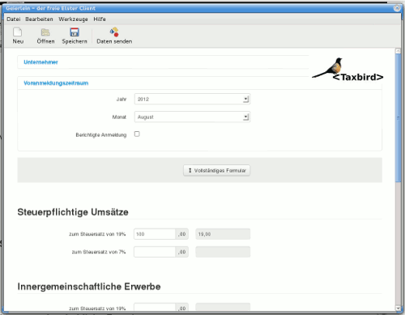

  <button class="close" data-dismiss="alert">×</button>
  Since this application is to be considered useful only for people living
  in Germany, the rest of this page is written in German language.

Geierlein ist ein [freier](http://de.wikipedia.org/wiki/Freie_Software)
[ELSTER](https://www.elster.de/)-Client zur Übermittlung von
[Umsatzsteuervoranmeldungen](http://de.wikipedia.org/wiki/Umsatzsteuervoranmeldung), der 2012 im
Rahmen des Taxbird-Projekts entstanden ist.

Taxbird ist ein im November 2004 ins Leben gerufenes und seither aktives Projekt,
das sich mit dem [ELSTER]()-Projekt der deutschen Finanzverwaltung im Rahmen freier Software befasst.

Geierlein soll
* **plattformunabhängig** sein, deshalb ist es in HTML5 & Javascript verfasst
* **schnell & einfach** sein, denn wer will sich schon lange mit der monatlichen Anmeldung befassen
* **unkompliziert** sein, deswegen wird standardmäßig nur eine verkürzte Fassung des Formulars
  gezeigt, das typische Fälle abdeckt

Um dem Look & Feel einer Desktopapplikation näher zu kommen, setzt Geierlein auf die
XUL-Schnittstelle des Firefox-Webbrowsers.  Das heißt, dass Geierlein auf jedem System läuft, auf
dem Firefox zur Verfügung steht.  Neben GNU/Linux steht damit einer Verwendung auch unter Windows,
MacOS, Android usf. nichts im Wege.

  <button class="close" data-dismiss="alert">×</button>
  Es ist momentan leider noch nicht möglich mit Geierlein Einkommensteuererklärungen bzw. andere
  Jahreserklärungen abzugeben.  Das liegt nicht an mir, sondern leider daran, dass diese nur über
  die ERiC-Schnittstelle übermittelbar sind, welche nur in Form proprietärer Software vorliegt und
  nicht nachentwickelt werden darf.

Hier noch ein Screenshot:

Da Geierlein im Hintergrund auf JavaScript & HTML5 setzt, sind auch alternative Frontends
unkompliziert möglich und denkbar.  Insbesondere eine Android-App soll mittelfristig noch entstehen.

Eine bereits einsetzbare Alternative stellt die Node.js-basierte Kommandozeilenversion von Geierlein
dar, quasi die  “Nerd-Lösung” zur Abgabe von Umsatzsteuervoranmeldungen. Du trägst deine Steuerdaten
in eine Art Konfigurationsdatei ein (Beispieldatei ist Teil des Geierlein-Pakets) und rufst
Geierlein auf. Das Ergebnis ist eine XHTML-Seite, die das Übertragungsprotokoll darstellt. Dieses
kannst du wahlweise Abspeichern oder mit einem beliebigen Browser anzeigen & ausdrucken.

## Wer steht hinter Geierlein & Taxbird?

Taxbird ist ein privates Projekt von mir, Stefan Siegl. Ich habe das Projekt Ende 2004 gegründet, da
ich selbst gelernter Steuerfachangestellter bin und der Thematik daher nahe stehe bzw. stand. Da ich
mich privat viel mit Computern im Allgemeinen und der Softwareentwicklung im Besonderen befasse,
drängte sich irgendwann die Frage auf, wie das ELSTER-Projekt denn im Detail funktioniert bzw. ich
bedauerte, dass es keine Lösung für GNU/Linux gab.

Letztlich bin ich bis dato kein Unternehmer, habe die entwickelte Software also selbst noch nie
verwenden können. Wenn du das Projekt nützlich findest, würde ich mich über eine kleine Beteiligung
an den Entwicklungskosten sehr freuen.
